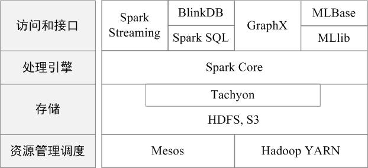
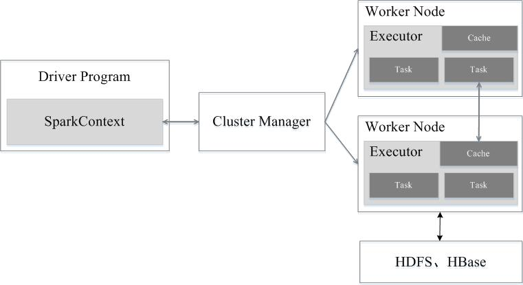
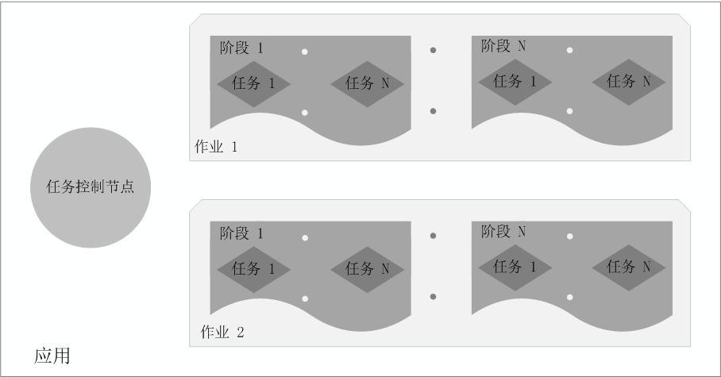
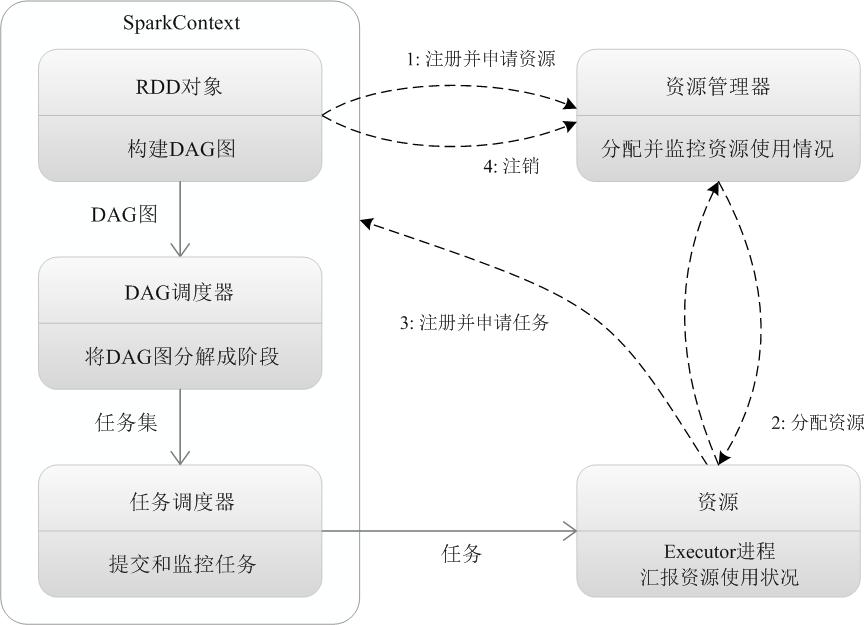

## 关于Spark
是基于内存计算的大数据并行计算框架，可用于构建大型的、低延迟的数据分析应用程序
### Spark具有如下几个主要特点
+ `运行速度快`：先进的`DAG`（Directed Acyclic Graph，有向无环图）执行引擎
+ `容易使用`：Spark支持使用Scala、Java、Python和R语言进行编程
+ `通用性`：Spark提供了完整而强大的技术栈，包括SQL查询、流式计算、机器学习和图算法组件
+ `运行模式多样`：Spark可运行于独立的集群模式中，或者运行于Hadoop中，也可运行于Amazon EC2等云环境中，并且可以访问HDFS、Cassandra、HBase、Hive等多种数据源

### Spark相对于Hadoop的优势

Hadoop存在如下一些缺点
+ `表达能力有限`：计算都必须要转化成Map和Reduce两个操作，但这并不适合所有的情况
+ `磁盘IO开销大`：每次执行时都需要从磁盘读取数据，并且在计算完成后需要将中间结果写入到磁盘中
+ `延迟高`：一次计算可能需要分解成一系列按顺序执行的MapReduce任务，任务之间的衔接由于涉及到IO开销，会产生较高延迟；在前一个任务执行完成之前，其他任务无法开始，难以胜任复杂、多阶段的计算任务

相比于MapReduce，Spark主要具有如下优点：
+ `编程模型比MapReduce更灵活`：Spark的计算模式也属于MapReduce，但不局限于Map和Reduce操作，还提供了多种数据集操作类型
+ `更高的迭代运算效率`：Spark提供了内存计算，中间结果直接放到内存中
+ Spark基于DAG的任务调度执行机制，优于MapReduce的迭代执行机制

`Spark最大的特点就是将计算数据、中间结果都存储在内存中，大大减少了IO开销`。Spark提供了实时交互式编程反馈，可以方便地验证、调整算法。

### Spark生态系统
在实际应用中，大数据处理主要包括以下三个类型：
+ `复杂的批量数据处理`：时间跨度通常在数十分钟到数小时之间；
+ `基于历史数据的交互式查询`：时间跨度通常在数十秒到数分钟之间；
+ `基于实时数据流的数据处理`：时间跨度通常在数百毫秒到数秒之间。

但是，对于互联网公司而言，通常会同时存在以上三种场景，就需要同时部署三种不同的软件，这样做难免会带来一些问题：
+ `数据类型转换`：不同场景之间输入输出数据无法做到无缝共享，通常需要进行数据格式的转换；
+ `维护成本`：不同的软件需要不同的开发和维护团队，带来了较高的使用成本；
+ `统一资源调配`：比较难以对同一个集群中的各个系统进行统一的资源协调和分配

Spark所提供的生态系统同时支持批处理、交互式查询和流数据处理。
Spark生态系统已经成为伯克利数据分析软件栈BDAS（Berkeley Data Analytics Stack）的重要组成部分。 
BDAS的架构如图所示：从中可以看出，Spark专注于数据的处理分析，而数据的存储还是要借助于Hadoop分布式文件系统HDFS、Amazon S3等来实现的

Spark的生态系统主要包含了Spark Core、Spark SQL、Spark Streaming、MLLib和GraphX 等组件：
+ `Spark Core`：Spark Core包含Spark的基本功能，如内存计算、任务调度、部署模式、故障恢复、存储管理等。通常所说的Apache Spark，就是指Spark Core
+ `Spark SQL`：Spark SQL允许开发人员直接处理RDD，同时也可查询Hive、HBase等外部数据源。
+ `Spark Streaming`：Spark Streaming支持高吞吐量、可容错处理的实时流数据处理，其核心思路是将流式计算分解成一系列短小的批处理作业。Spark Streaming支持多种数据输入源，如Kafka、Flume和TCP套接字等
+ `MLlib（机器学习）`：MLlib提供了常用机器学习算法的实现，包括聚类、分类、回归、协同过滤等，降低了机器学习的门槛
+ `GraphX（图计算）`：GraphX是Spark中用于图计算的API，可认为是Pregel在Spark上的重写及优化，Graphx性能良好，拥有丰富的功能和运算符，能在海量数据上自如地运行复杂的图算法

### Spark运行架构
几个基本概念：
+ `RDD`：是弹性分布式数据集（Resilient Distributed Dataset）的简称，是分布式内存的一个抽象概念，提供了一种高度受限的共享内存模型；
+ `DAG`：是Directed Acyclic Graph（有向无环图）的简称，反映RDD之间的依赖关系；
+ `Executor`：是运行在工作节点（Worker Node）上的一个进程，负责运行任务，并为应用程序存储数据；
+ `应用`：用户编写的Spark应用程序；
+ `任务`：运行在Executor上的工作单元；
+ `作业`：一个作业包含多个RDD及作用于相应RDD上的各种操作；
+ `阶段`：是作业的基本调度单位，一个作业会分为多组任务，每组任务被称为“阶段”，或者也被称为“任务集”。

### 架构设计
Spark运行架构:
+ Spark运行架构包括集群资源管理器（Cluster Manager）、运行作业任务的工作节点（Worker Node）、每个应用的任务控制节点（Driver）和每个工作节点上负责具体任务的执行进程（Executor）
+ Spark所采用的Executor有两个优点： 
  + 一是利用多线程来执行具体的任务（Hadoop MapReduce采用的是进程模型），减少任务的启动开销；
  + 二是Executor中有一个 BlockManager 存储模块，会将内存和磁盘共同作为存储设备，当需要多轮迭代计算时，可以将中间结果存储到这个存储模块里，下次需要时，就可以直接读该存储模块里的数据，而不需要读写到HDFS等文件系统里，因而有效减少了IO开销
+ 

相互关系:
+ 在Spark中，一个应用（Application）由一个任务控制节点（Driver）和若干个作业（Job）构成;
+ 一个作业由多个阶段（Stage）构成
+ 一个阶段由多个任务（Task）组成。
+ 当执行一个应用时，任务控制节点会向集群管理器（Cluster Manager）申请资源，启动Executor，并向Executor发送应用程序代码和文件，然后在Executor上执行任务
+ 运行结束后，执行结果会返回给任务控制节点，或者写到HDFS或者其他数据库中
+ 
### Spark运行基本流程
1）当一个Spark应用被提交时，首先需要为这个应用构建起基本的运行环境 
&nbsp即由任务控制节点（Driver）创建一个SparkContext，由SparkContext负责和资源管理器（Cluster Manager）的通信以及进行资源的申请、任务的分配和监控等 
2）资源管理器为Executor分配资源，并启动Executor进程，Executor运行情况将随着“心跳”发送到资源管理器上 
3）SparkContext根据RDD的依赖关系构建DAG图，DAG图提交给DAG调度器（DAGScheduler）进行解析，将DAG图分解成多个“阶段”（每个阶段都是一个任务集），并且计算出各个阶段之间的依赖关系，然后把一个个“任务集”提交给底层的任务调度器（TaskScheduler）进行处理；Executor向SparkContext申请任务，任务调度器将任务分发给Executor运行，同时，SparkContext将应用程序代码发放给Executor； 
4）任务在Executor上运行，把执行结果反馈给任务调度器，然后反馈给DAG调度器，运行完毕后写入数据并释放所有资源

### Spark运行架构具有以下特点
+ 每个应用都有自己专属的Executor进程，并且该进程在应用运行期间一直驻留。 
Executor进程以多线程的方式运行任务，减少了多进程任务频繁的启动开销，使得任务执行变得非常高效和可靠；
+ Spark运行过程与资源管理器无关，只要能够获取Executor进程并保持通信即可；
+ Executor上有一个BlockManager存储模块，类似于键值存储系统（把内存和磁盘共同作为存储设备），在处理迭代计算任务时，不需要把中间结果写入到HDFS等文件系统，而是直接放在这个存储系统上，后续有需要时就可以直接读取； 
在交互式查询场景下，也可以把表提前缓存到这个存储系统上，提高读写IO性能；
+ 任务采用了数据本地性和推测执行等优化机制。数据本地性是尽量将计算移到数据所在的节点上进行，即“计算向数据靠拢”，因为移动计算比移动数据所占的网络资源要少得多。
 而且，Spark采用了延时调度机制，可以在更大的程度上实现执行过程优化。比如，拥有数据的节点当前正被其他的任务占用，那么，在这种情况下是否需要将数据移动到其他的空闲节点呢？答案是不一定。因为，如果经过预测发现当前节点结束当前任务的时间要比移动数据的时间还要少，那么，调度就会等待，直到当前节点可用。

## RDD的设计与运行原理
Spark的核心是建立在统一的抽象RDD之上，使得Spark的各个组件可以无缝进行集成，在同一个应用程序中完成大数据计算任务。

#### 1.RDD设计背景
+ 背景：在实际应用中，存在许多迭代式算法（比如机器学习、图算法等）和交互式数据挖掘工具，这些应用场景的共同之处是，不同计算阶段之间会重用中间结果，即一个阶段的输出结果会作为下一个阶段的输入。但是，目前的MapReduce框架都是把中间结果写入到HDFS中，带来了大量的数据复制、磁盘IO和序列化开销
+ 产物：RDD就是为了满足这种需求而出现的，它提供了一个抽象的数据架构，我们不必担心底层数据的分布式特性，只需将具体的应用逻辑表达为一系列转换处理，不同RDD之间的转换操作形成依赖关系，可以实现管道化，从而避免了中间结果的存储，大大降低了数据复制、磁盘IO和序列化开销。

#### 2.RDD概念

RDD 就是为了满足这种需求而实现的，他提供了一个抽象的数据架构，我们不必担心底层数据的分布式特性，只需要将具体的应用逻辑表达为一系列转换处理，不同的RDD之间的转换操作形成依赖关系，可以实现管道化，从而避免了中间结果的存储，大大降低了数据复制。磁盘IO喝序列化开销。

